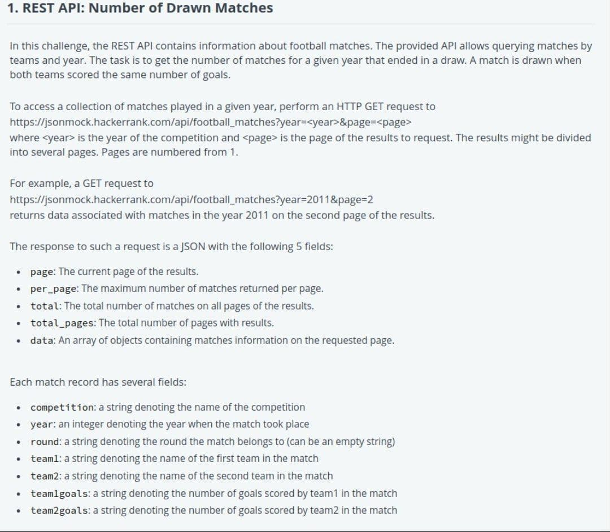
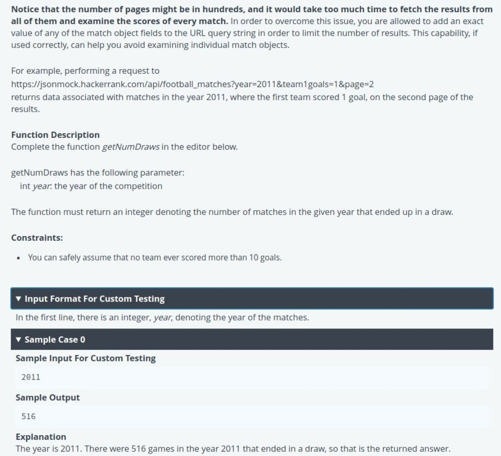
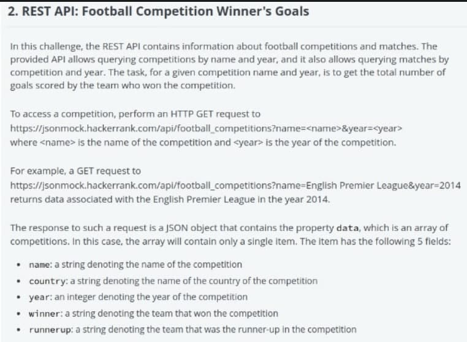
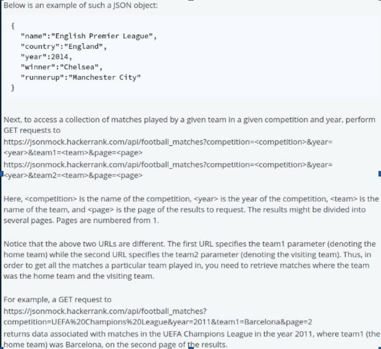
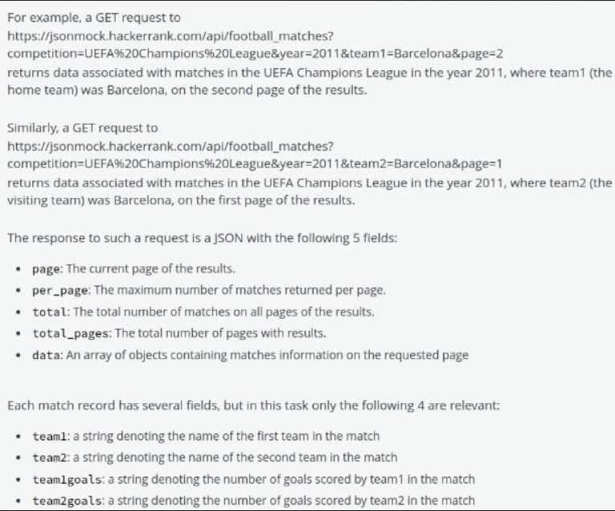
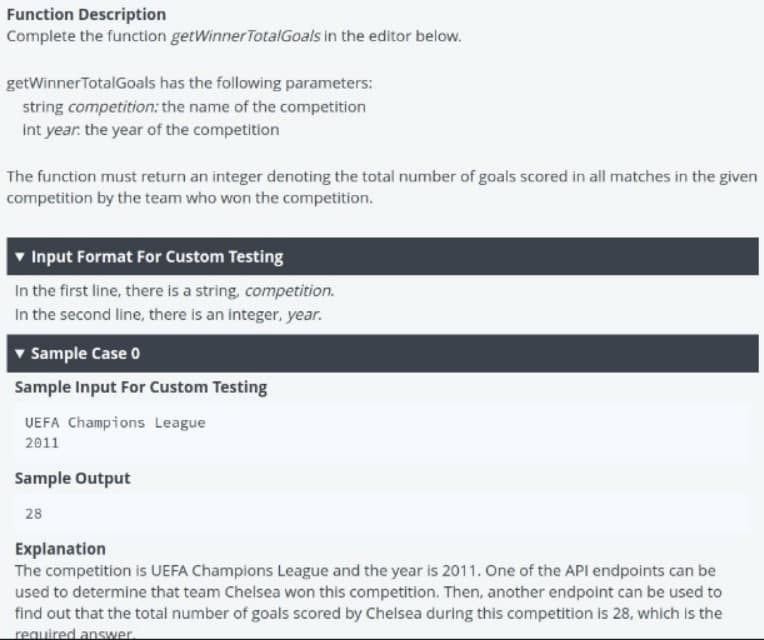

# Rest-API-Intermediate-Hackerrank-Test
## Question 1
 
 
Solution : Only done with 10 GET requests by taking advantage of the constraint of maximum of 10 goals scored by any team.
```javascript
let goals=[];
for(let i=0;i<=10;i++)
    goals.push(i);
let ans=0;
async function getDrawnMatches(year) {
    
      await Promise.all(
        goals.map(async (goal) => {
            const respone = await fetch("https://jsonmock.hackerrank.com/api/football_matches?year=${year}&team1goals=+goal+&team2goals="+goal);
            const data = await respone.json();
            ans+=data.total;
            console.log(ans);
        })
      );
      return ans;
}
getDrawnMatches
    (2011).then((answer) => console.log(answer));
```
___
## Question 2
 




Solution : Only done with (1+10+10) GET requests by taking advantage of the constraint of maximum of 10 goals scored by any team.  
            1 for finding the winner 
            10 for summing the goals for home matches  
            10 for summing the goals for away mathces  
```javascript
let goals = [];
for (let i = 0; i <= 10; i++)
    goals.push(i);

async function getGoalsScored(competition, year) {
    let ans = 0;
    let response = await fetch("https://jsonmock.hackerrank.com/api/football_competitions?year=${year}&name=" + competition);
    let data = await response.json();
    let winner = data.data[0].winner;
    console.log(winner);

    await Promise.all(
        goals.map(async (goal) => {
            const respone = await fetch("https://jsonmock.hackerrank.com/api/football_matches?competition=" + competition + "&year=" + year + "&team1=" + "winner+&team1goals="+goal);
            const data = await respone.json();
            ans += data.total * goal;
        })
    );
    await Promise.all(
        goals.map(async (goal) => {
            const respone = await fetch("https://jsonmock.hackerrank.com/api/football_matches?competition=" + competition + "&year=" + year + "&team2=" + "winner+&team2goals="+goal);
            const data = await respone.json();
            ans += data.total * goal;
        })
    );
    return ans;
}
getGoalsScored
    ("UEFA Champions League", 2011).then((answer) => console.log(answer));
```
